# 💫 About Me

👋 Hi, I'm **Aryan Petwal**!

🎓 B.Tech CSE student passionate about **programming, problem-solving, and software development**.  
💻 Currently focused on **Java, Object-Oriented Programming, and Data Structures & Algorithms**.  
🧩 Regularly practicing **LeetCode** to strengthen my problem-solving and coding skills.  
🌐 Exploring **Web Development** and building small practical projects.  
🚀 Interested in building real-world projects and continuously improving my technical skills.  
📚 Currently learning how to write cleaner, more efficient, and maintainable code.  
🤝 Open to **collaboration, learning opportunities, and connecting with fellow developers**.

---

## 🎯 Current Focus

- ☕ Java & Object-Oriented Programming
- 🧠 Data Structures & Algorithms
- 🧩 LeetCode Problem Solving
- 🌐 HTML, CSS & JavaScript
- 🗄️ MySQL & Database Fundamentals
- 🚀 Building practical projects
- 📈 Improving problem-solving and coding consistency

---

## 🌐 Socials

&nbsp;&nbsp;
&nbsp;&nbsp;
&nbsp;&nbsp;
&nbsp;&nbsp;
&nbsp;&nbsp;
&nbsp;&nbsp;
&nbsp;&nbsp;
&nbsp;&nbsp;
&nbsp;&nbsp;
&nbsp;&nbsp;
&nbsp;&nbsp;
&nbsp;&nbsp;
&nbsp;&nbsp;
&nbsp;&nbsp;

---

# 💻 Tech Stack

### 👨‍💻 Programming

### 🌐 Web Development

### 🗄️ Database

---

# 🚀 Projects

### 🎵 Sound Activated Switch

An Arduino-based project that uses sound detection to control a device.

**Tech:** Arduino • Tinkercad • Electronics

---

### 📝 To-Do List

A simple web application for managing and organizing daily tasks.

**Tech:** HTML • CSS • JavaScript

---
## 🧩 LeetCode

  

> 🧠 Consistently practicing Data Structures & Algorithms to improve problem-solving and coding skills.

---

## 📊 GitHub Stats

  
  

  

---

## 🏆 GitHub Trophies

  

